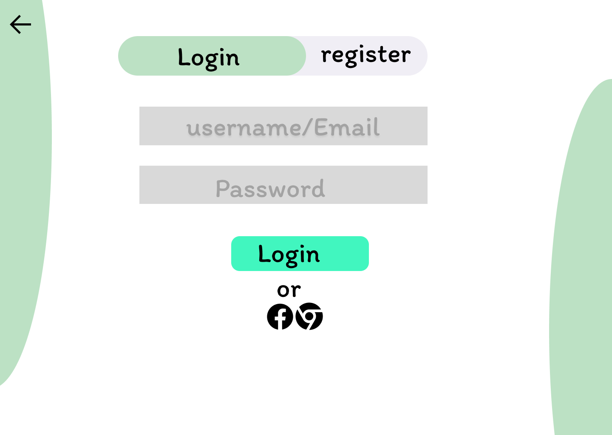
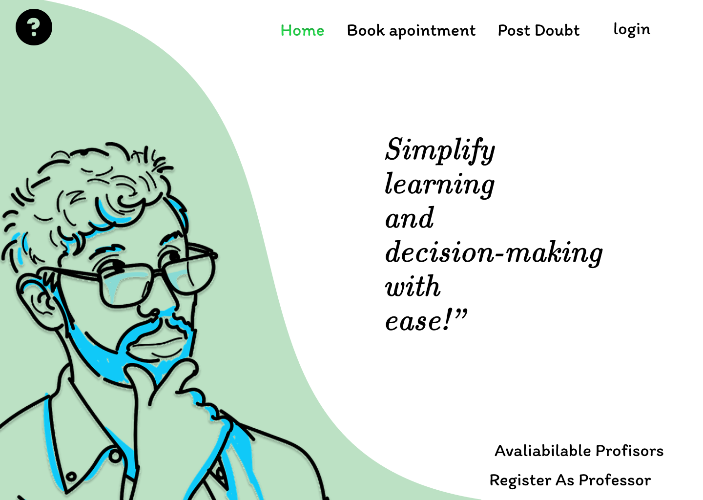

# Clarify Doubts – Q&A Platform for Students & Professors

Clarify Doubts is a full-stack web application designed to bridge the communication gap between students and professors while promoting collaborative learning. The platform allows students to post academic doubts, which can be addressed not only by registered professors but also by peers, fostering a community-driven learning environment.

The system is designed with simplicity and accessibility in mind, ensuring that users with minimal technical experience can easily sign up, log in, and interact. It also incorporates intelligent features like YouTube video recommendations based on the context of the question to provide relevant external resources.

---

## ✨ Features

- 🔐 User authentication for students and professors
- ❓ Students can post and manage doubts
- 🧑‍🏫 Professors and peers can answer questions
- 🎥 YouTube video recommendations based on queries
- 🎨 Responsive UI using Bootstrap
- 📞 User can Book Apointment with Registered professors for direct interaction
- 🗃️ MongoDB used to store users, questions, and answers

---

## 🛠️ Tech Stack

- **Frontend:** ReactJS, Bootstrap
- **Backend:** Node.js, Express.js
- **Database:** MongoDB (via Mongoose)
- **Others:** YouTube Data API (optional), JWT for auth

---

## 📸 Screenshots

<table>
  <tr>
    <td align="center">
      <br/>
      <strong>Landing page</strong>
    </td>
    <td align="center">
      <br/>
      <strong>Login Screen</strong>
    </td>
    <td align="center">
      <br/>
      <strong>Dashboard</strong>
    </td>
  </tr>
  <tr>
    <td align="center">
      <br/>
      <strong>Query & Answers</strong>
    </td>
     <td align="center">
      <br/>
      <strong>Book Appointment</strong>
    </td>
  </tr>
</table>

---

## 🚀 How to Run on Local System

1. **Clone the repository**
   ```bash
   git clone https://github.com/your-username/clarify-doubts-app.git
   cd clarify-doubts-app
   ```

2. **Install frontend dependencies**
   ```bash
   cd client
   npm install
   ```

3. **Install backend dependencies**
   ```bash
   cd ../server
   npm install
   ```

4. **Create `.env` file for backend config**
   Inside the `server/` folder:
   ```env
   MONGO_URI=your_mongodb_connection_string
   JWT_SECRET=your_jwt_secret
   YOUTUBE_API_KEY=your_youtube_api_key (optional)
   ```

5. **Start the backend**
   ```bash
   npm start
   ```

6. **Start the frontend**
   Open a new terminal and go to:
   ```bash
   cd client
   npm start
   ```

---


```

---

## 🙌 Contribution

Pull requests are welcome! If you’d like to contribute, please fork the repo and create a PR with your enhancements.

---

## 📬 Contact

Feel free to reach out via [narendrachakka33@gmail.com] or connect on [LinkedIn](www.linkedin.com/in/narendra1903).

